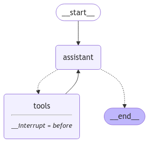

# Virtual Sales Agent powered by LangGraph, Streamlit & Gemini Flash

This project implements a Virtual Sales Agent that simulates customer interactions, providing information and support through a Streamlit interface. Using the power of **LangChain**, **LangGraph**, and a SQLite database, this agent can answer product questions, create orders, check order statuses, and offer personalized recommendations.



## ✨ Key Features

This virtual sales agent can assist customers with:

1.  **Product Inquiries:**
    *   Answer questions about product availability, pricing, and stock levels.
    *   **Example Questions:**
        *   "What products do you have in stock?"
        *   "How much does product X cost?"
        *   "Is product Y available?"
2.  **Order Placement:**
    *   Allow customers to create new orders, referencing data from the database.
    *   **Example Request:** "I would like to order 2 units of product Z."
3.  **Order Tracking:**
    *   Provide up-to-date status information for existing orders.
    *   **Example Question:** "What is the status of order #54321?"
4.  **Personalized Recommendations:**
    *   Suggest relevant products based on a customer's past purchase history.
    *   **Example Recommendation:** "Based on your previous order, you might also like product A."

## 🛠️ Built With

*   **LangChain:** Provides the framework for developing AI-powered conversational applications.
*   **LangGraph:** Enables the creation of sophisticated, stateful agent workflows.
*   **SQLite:** A lightweight database for managing product data and orders.
*   **Streamlit:** Facilitates the development of interactive web applications for the agent interface.
*   **Gemini Flash 2.0:** A fast and efficient large language model from Google for natural language understanding.

## 📂 Project Structure

Here's a breakdown of the project's directory structure:

```
.
├── assets/
│   ├── graph.png             # Agent workflow diagram
│   └── style.css             # Streamlit custom styling
├── database/
│   ├── db/
│   │   ├── products.json         # Bot product data (initial)
│   │   └── schemas.sql           # SQL schema definitions
│   ├── db_manager.py             # Handles database interactions
│   └── config.py                 # Database connection configuration
├── virtual_sales_agent/
│   ├── graph.py                  # LangGraph agent state machine and logic
│   ├── tools.py                  # Custom tools used by the agent
│   └── utils_functions.py        # Utility functions for the agent
├── env-example                 # Environment variables template
├── main.py                       # Main Streamlit app
├── requirements.txt              # Project dependencies
├── README.md                     # This file!
└── setup_database.py             # Script to initialize the database
```

## 🚀 Get Started

Follow these steps to set up and run the Virtual Sales Agent:

### 1. Prerequisites

*   Ensure you have **Python 3.12 or later** installed on your machine.
*   We recommend using a virtual environment for managing dependencies.

### 2. Installation Steps

1.  **Clone the Repository:**
    ```bash
    git clone https://github.com/lucasboscatti/virtual-sales-agent-langgraph.git
    cd virtual-sales-agent
    ```

2.  **Create a Virtual Environment:**
    ```bash
    python3 -m venv venv
    source venv/bin/activate   # Linux/Mac
    venv\Scripts\activate       # Windows
    ```

3.  **Install Dependencies:**
    ```bash
    pip install -r requirements.txt
    ```

4.  **Environment Configuration:**
    *   **Rename the `.env-example` file to `.env`.**
    *   **Set up your API keys:**
        *   **Google Gemini Flash:** Requires a `GOOGLE_API_KEY`, along with your `GOOGLE_APPLICATION_CREDENTIALS` (path to your credentials file), `GCP_PROJECT_ID` and `REGION`. Obtain these from your Google Cloud Platform (GCP) account at [Google AI Studio](https://aistudio.google.com/).
        *   **LangSmith:** Create a [LangSmith](https://smith.langchain.com/) account and get your `LANGCHAIN_API_KEY`. This is for monitoring and debugging agent interactions.
    *   **Load environment variables:**
        ```bash
        source .env
        ```

5.  **Initialize the Database:**
    ```bash
    python3 setup_database.py
    ```

6.  **Launch the Streamlit App:**
    ```bash
    streamlit run main.py
    ```

    This will open the application in your web browser, and you can start interacting with the Virtual Sales Agent.

##  🤝 Contributing

Contributions are welcome! If you have ideas for improvements or bug fixes, feel free to submit a pull request.